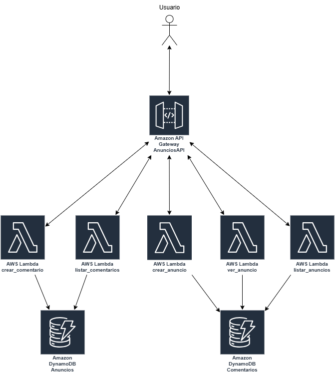

# Diagrama y explicación

## Resumen

El usuario interactúa con la aplicación a través de una API REST expuesta por Amazon API Gateway, que sirve como punto de entrada para realizar operaciones sobre anuncios y comentarios. Cuando un usuario envía una solicitud GET o POST desde un cliente (como curl o Postman), API Gateway redirige la petición a una función AWS Lambda, la cual ejecuta la lógica necesaria para procesar anuncios o comentarios. AWS Lambda luego interactúa con Amazon DynamoDB, almacenando o recuperando datos según corresponda, y devuelve una respuesta estructurada al usuario. Todos estos componentes operan de manera serverless, asegurando escalabilidad, bajo costo y alta disponibilidad.

### Servicios AWS Implementados

#### AWS Lambda
- **Propósito**: Procesamiento de lógica de negocio
- **Beneficios**:
  * Ejecución de código sin gestión de servidores
  * Escalabilidad automática 

#### Amazon API Gateway
- **Propósito**: Gestión de endpoints REST
- **Características**:
  * Integración con funciones Lambda

#### Amazon DynamoDB
- **Propósito**: Almacenamiento de datos de anuncios y comentarios
- **Ventajas**:
  * Base de datos NoSQL
  * Alta disponibilidad
  * Escalabilidad horizontal sin gestión de infraestructura

#### AWS IAM (Identity and Access Management)
- **Propósito**: Control de acceso y seguridad
- **Funcionalidades**:
  * Gestión de permisos
  * Seguridad de credenciales entre servicios

### Diseño de Infraestructura

La arquitectura serverless permite:
- Ejecución de código bajo demanda
- Escalabilidad automática
- Funciones Lambda independientes
- Componentes desacoplados

## Endpoints de la API

### Operaciones Implementadas

1. **Gestión de Anuncios**
   - `GET /anuncios`: Recuperar lista de anuncios
   - `POST /anuncios`: Crear nuevos anuncios
   - `GET /anuncios/{id}`: Consultar anuncio específico

2. **Gestión de Comentarios**
   - `POST /anuncios/{id}/comentarios`: Añadir comentarios
   - `GET /anuncios/{id}/comentarios`: Listar comentarios asociados a un anuncio

