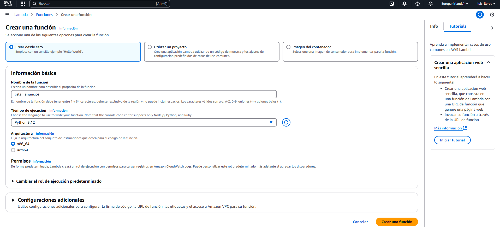

# PASOS A SEGUIR

## 1. Crear tablas en DYNAMODB
### Tabla "Anuncios"
Almacena los anuncios publicados.

- **Partition Key:** `id` (tipo **String**)

### Tabla "Comentarios"
Almacena los comentarios asociados a los anuncios.

- **Partition Key:** `anuncio_id` (tipo **String**)
- **Sort Key:** `comentario_id` (tipo **String**)

---

## 2. Crear las Funciones Lambda
Cada función Lambda manejará un endpoint de la API.


### 1️ Crear función `listar_anuncios`

```python
import json
import boto3

dynamodb = boto3.resource('dynamodb')
table = dynamodb.Table('Anuncios')

def lambda_handler(event, context):
    response = table.scan()
    return {
        "statusCode": 200,
        "body": json.dumps(response['Items'])
    }
```


### 2️ Crear función `ver_anuncio`

```python
import json
import boto3

dynamodb = boto3.resource('dynamodb')
table = dynamodb.Table('Anuncios')

def lambda_handler(event, context):
    try:
        # 🔹 Verificar si 'pathParameters' está presente antes de acceder a 'id'
        anuncio_id = event.get('pathParameters', {}).get('id')

        if not anuncio_id:
            return {
                "statusCode": 400,
                "body": json.dumps({"error": "El ID del anuncio no fue proporcionado correctamente"})
            }

        # 🔹 Buscar el anuncio en DynamoDB
        response = table.get_item(Key={'id': anuncio_id})

        # 🔹 Si no existe, devolver un error 404
        if 'Item' not in response:
            return {
                "statusCode": 404,
                "body": json.dumps({"error": "Anuncio no encontrado"})
            }

        return {
            "statusCode": 200,
            "body": json.dumps(response['Item'])
        }

    except Exception as e:
        return {
            "statusCode": 500,
            "body": json.dumps({"error": str(e)})
        }
```

### 3️ Crear función `crear_anuncio`

```python
import json
import boto3
import uuid

dynamodb = boto3.resource('dynamodb')
table = dynamodb.Table('Anuncios')

def lambda_handler(event, context):
    try:
        # Revisar si el body ya es un diccionario o si es string JSON
        if isinstance(event['body'], str):
            data = json.loads(event['body'])  # Si es string, convertir a diccionario
        else:
            data = event['body']  # Si ya es diccionario, usarlo directamente

        # Crear anuncio con ID único
        anuncio = {
            'id': str(uuid.uuid4()),
            'titulo': data.get('titulo', 'Sin título'),
            'descripcion': data.get('descripcion', 'Sin descripción')
        }

        # Guardar en DynamoDB
        table.put_item(Item=anuncio)

        return {
            "statusCode": 200,
            "body": json.dumps(anuncio)
        }
    except Exception as e:
        return {
            "statusCode": 400,
            "body": json.dumps({"error": str(e)})
        }
```

### 4️ Crear función `listar_comentarios`

```python
import json
import boto3

dynamodb = boto3.resource('dynamodb')
table = dynamodb.Table('Comentarios')

def lambda_handler(event, context):
    anuncio_id = event['pathParameters']['id']
    
    response = table.query(
        KeyConditionExpression='anuncio_id = :anuncio_id',
        ExpressionAttributeValues={':anuncio_id': anuncio_id}
    )

    return {
        "statusCode": 200,
        "body": json.dumps(response.get('Items', []))
    }

```

### 5️ Crear función `crear_comentario`

```python
import json
import boto3
import uuid
from datetime import datetime

dynamodb = boto3.resource('dynamodb')
table = dynamodb.Table('Comentarios')

def lambda_handler(event, context):
    try:
        
        anuncio_id = event.get('pathParameters', {}).get('id')
        if not anuncio_id:
            return {
                "statusCode": 400,
                "body": json.dumps({"error": "El ID del anuncio no fue proporcionado correctamente"})
            }


        body = event.get('body', {})
        if isinstance(body, str):
            data = json.loads(body)  # Si es string, convertir a diccionario
        else:
            data = body  # Si ya es diccionario, usarlo directamente

        usuario = data.get('usuario')
        mensaje = data.get('mensaje')
        if not usuario or not mensaje:
            return {
                "statusCode": 400,
                "body": json.dumps({"error": "Faltan datos en la solicitud"})
            }


        comentario = {
            'anuncio_id': anuncio_id,
            'comentario_id': str(uuid.uuid4()),
            'usuario': usuario,
            'mensaje': mensaje,
            'fecha': datetime.utcnow().isoformat()
        }

        #Guardar en DynamoDB
        table.put_item(Item=comentario)

        return {
            "statusCode": 200,
            "body": json.dumps(comentario)
        }

    except Exception as e:
        return {
            "statusCode": 500,
            "body": json.dumps({"error": str(e)})
        }

```

---

## 3. Configurar API Gateway
Conectamos los endpoints con las funciones Lambda.

### 1️ Crear API en API Gateway
- Seleccionar `API REST` y llamarla **`AnunciosAPI`**.

### 2️ Crear los Endpoints

####  Crear Recurso `/anuncios`
- **Nombre:** `anuncios`
- **Path:** `/anuncios`
- **Métodos:**
  - `GET` → Conectar con `listar_anuncios`
  - `POST` → Conectar con `crear_anuncio`
    - **En "Plantillas de Mapeo", añadir:**
      ```json
      {
          "body": $input.json('$')
      }
      ```

####  Crear Recurso `/anuncios/{id}`
- **Nombre:** `{id}`
- **Path:** `/anuncios/{id}`
- **Método `GET`** → Conectar con `ver_anuncio`
  - **En "Plantillas de Mapeo", añadir:**
    ```json
    {
        "pathParameters": {
            "id": "$input.params('id')"
        }
    }
    ```

####  Crear Recurso `/anuncios/{id}/comentarios`
- **Nombre:** `comentarios`
- **Path:** `/anuncios/{id}/comentarios`
- **Métodos:**
  - `GET` → Conectar con `listar_comentarios`
  - `POST` → Conectar con `crear_comentario`
    - **En "Plantillas de Mapeo", añadir:**
      ```json
      {
          "pathParameters": {
              "id": "$input.params('id')"
          },
          "body": $input.json('$')
      }
      ```

---

## 4. Implementar la API
1. Desde `AnunciosAPI`, hacer clic en **"Implementar API"**.
2. **Etapa:** `prod`
3. **Descripción:** `"API de anuncios con comentarios"`
4. Guardar.

---

## 5. Asignar permisos en IAM
Dar permisos a cada función Lambda para acceder a DynamoDB.

### 🔹 Permiso de escritura (`AmazonDynamoDBFullAccess`)
- `crear_anuncio`
- `crear_comentario`

### 🔹 Permiso de solo lectura (`AmazonDynamoDBReadOnlyAccess`)
- `listar_anuncios`
- `listar_comentarios`
- `ver_anuncio`

####  Cómo asignar permisos en IAM:
1. **Ir a AWS IAM > Roles**
2. **Seleccionar el rol de cada función Lambda.**
3. **Agregar la política de permisos correcta.**
4. **Guardar los cambios.**

---

## 6. Probar la API con `curl`
Después de desplegar la API, prueba los endpoints usando `curl`.

### Crear un anuncio (POST /anuncios)
curl -X POST "https://7d82ges3t7.execute-api.eu-west-1.amazonaws.com/prod/anuncios" -H "Content-Type: application/json" -d "{\"titulo\": \"Prueba 1\", \"descripcion\": \"Esta es una descripción de prueba.\"}"

### Extraer anuncios (GET /anuncios)
curl -X GET "https://7d82ges3t7.execute-api.eu-west-1.amazonaws.com/prod/anuncios"

### Extraer anuncio por ID (GET /anuncios/{id})
curl -X GET "https://7d82ges3t7.execute-api.eu-west-1.amazonaws.com/prod/anuncios/9fd2c650-bd90-4d4a-b10c-9f59d89acd6b"

### Crear comentario en un anuncio (POST /anuncios/{id}/comentarios)
curl -X POST "https://7d82ges3t7.execute-api.eu-west-1.amazonaws.com/prod/anuncios/9fd2c650-bd90-4d4a-b10c-9f59d89acd6b/comentarios" \
     -H "Content-Type: application/json" \
     -d "{\"usuario\": \"Usuario prueba post comentario\", \"mensaje\": \"prueba de comentario 2\"}"

### Extraer comentarios de un anuncio particular (GET /anuncios/{id}/comentarios)
curl -X GET "https://7d82ges3t7.execute-api.eu-west-1.amazonaws.com/prod/anuncios/9fd2c650-bd90-4d4a-b10c-9f59d89acd6b/comentarios"


